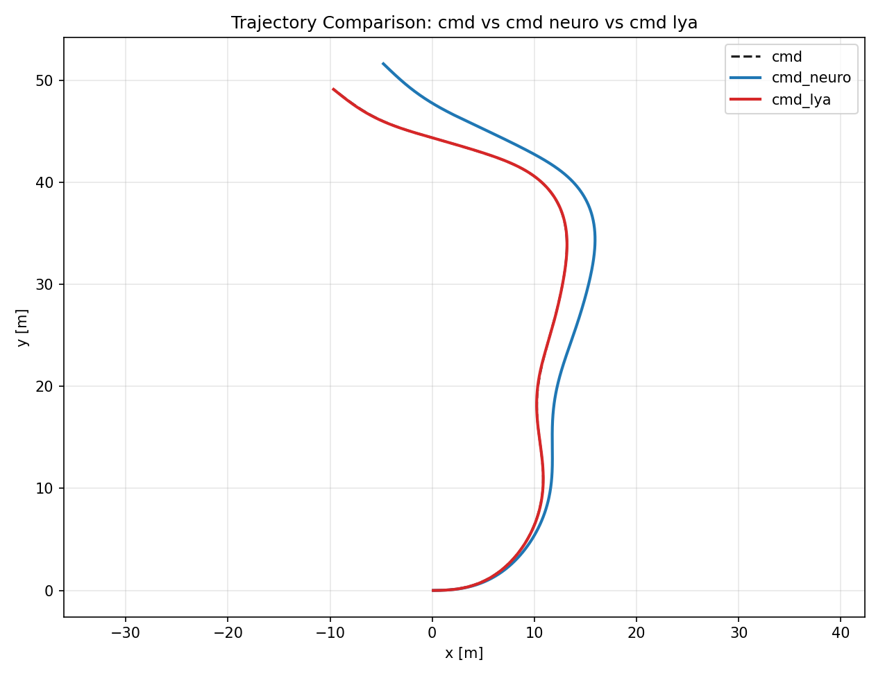
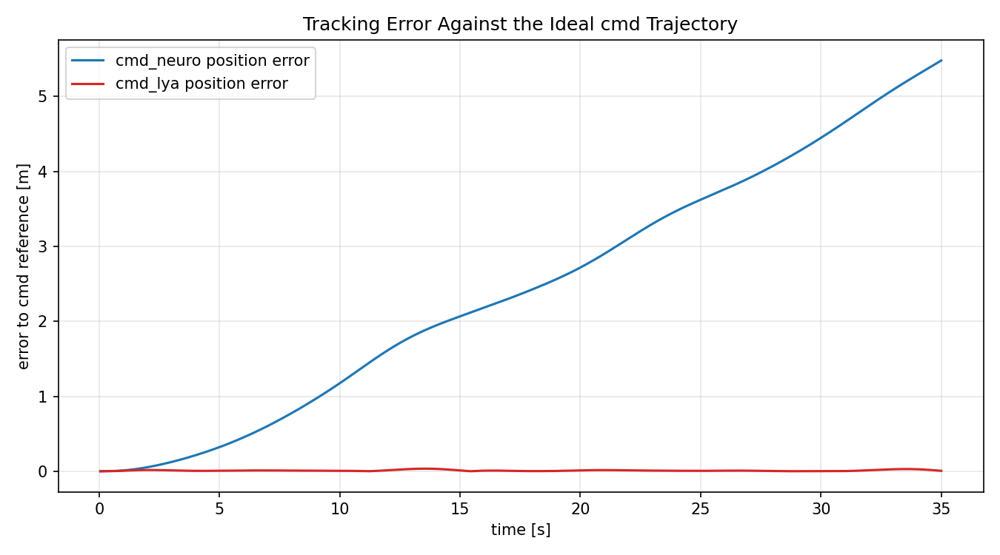
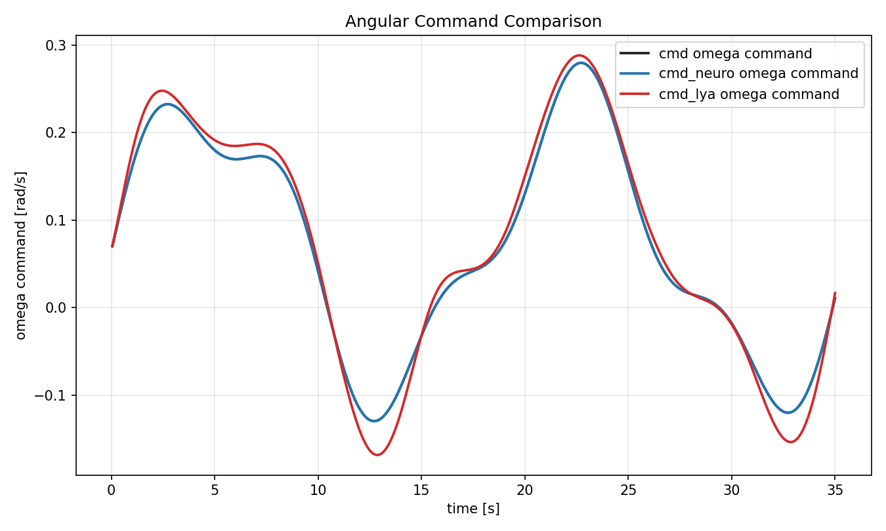
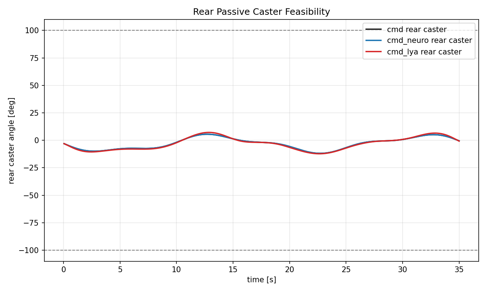
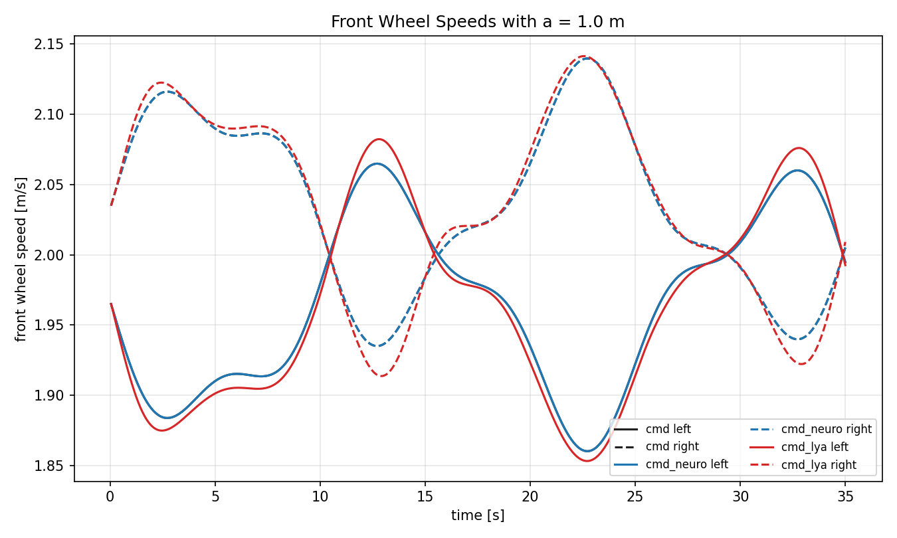

# cmd / cmd neuro / cmd lya Trajectory Simulation

## Setup

- Working directory: `E:\Mess\Projects\Programming\aiformula\neurokin_mpc\lya\cmd_neuro_lya`
- NeuroKin weight: `E:\Mess\Projects\Programming\aiformula\neurokin_mpc\runs\20260430_004732\neurokin_forward_model.pt`
- Checkpoint best_val_loss: `0.001493420414947744`
- Model type: `constrained_velocity_gru`
- dt: `0.04999999999999716` s
- total_time: `35.0` s
- front axle track `a`: `1.0` m
- front-to-rear passive caster distance `b`: `1.5` m
- rear caster limit: `+/-100.0` deg

## Definitions

- `cmd`: ideal front differential-drive command integration.
- `cmd_neuro`: same command sequence rolled through the latest NeuroKin model.
- `cmd_lya`: Lyapunov feedback command tracking the `cmd` reference, then rolled through the same NeuroKin model.

## Lyapunov Controller Used for cmd_lya

$$
e_x=\cos\theta(x_d-x)+\sin\theta(y_d-y)
$$

$$
e_y=-\sin\theta(x_d-x)+\cos\theta(y_d-y)
$$

$$
e_\theta=\operatorname{wrap}(\theta_d-\theta)
$$

$$
v=v_d\cos e_\theta+1.0e_x
$$

$$
\omega=\omega_d+0.6v_de_y+1.2\sin e_\theta
$$

Command limits used in this learned-model simulation: `v in [0.0, 2.4]`, `omega in [-0.8, 0.8]`.

## Summary

| mode | final pos error [m] | mean pos error [m] | max pos error [m] | final heading error [rad] | max caster [deg] | caster feasible |
|---|---:|---:|---:|---:|---:|---:|
| `cmd` | 0.0000 | 0.0000 | 0.0000 | 0.0000 | 11.84 | 100.0% |
| `cmd_neuro` | 5.4794 | 2.4378 | 5.4794 | 0.1030 | 11.84 | 100.0% |
| `cmd_lya` | 0.0061 | 0.0102 | 0.0346 | 0.0124 | 12.21 | 100.0% |

## Figures

## Interpretation Caveat

The Lyapunov proof is exact for the ideal kinematic model. In `cmd_lya` here, the controller is applied to the learned NeuroKin rollout, so this is a practical simulation comparison, not a new formal stability proof for the neural plant.
