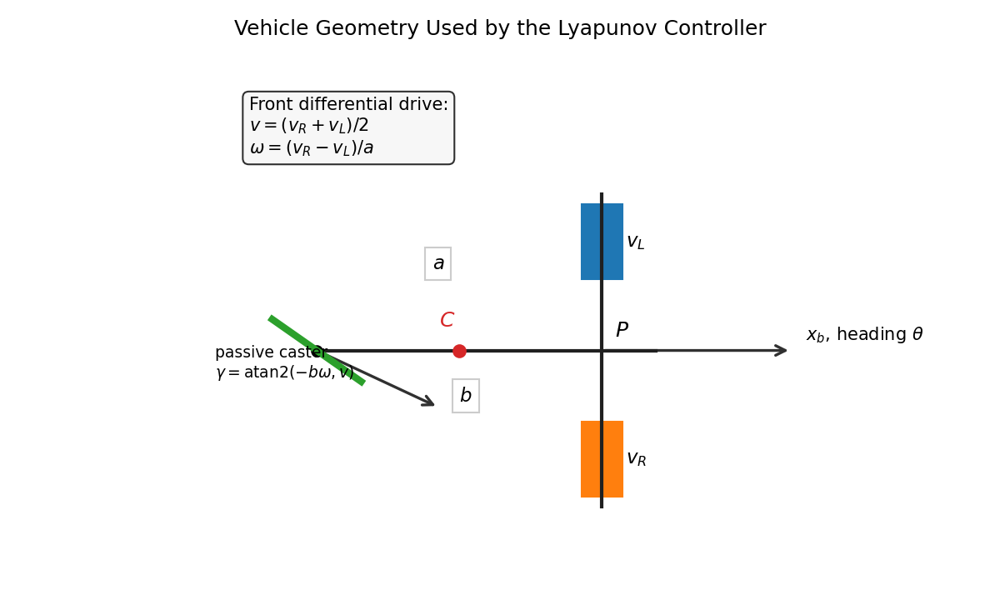
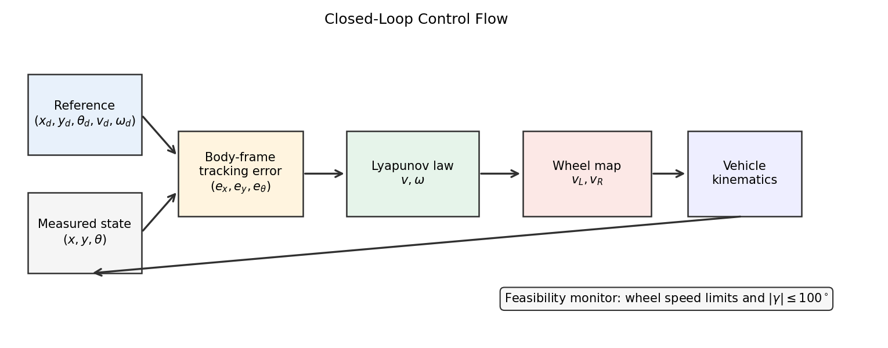
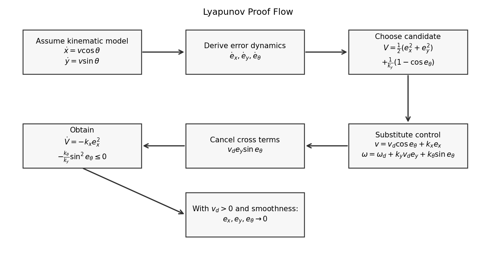
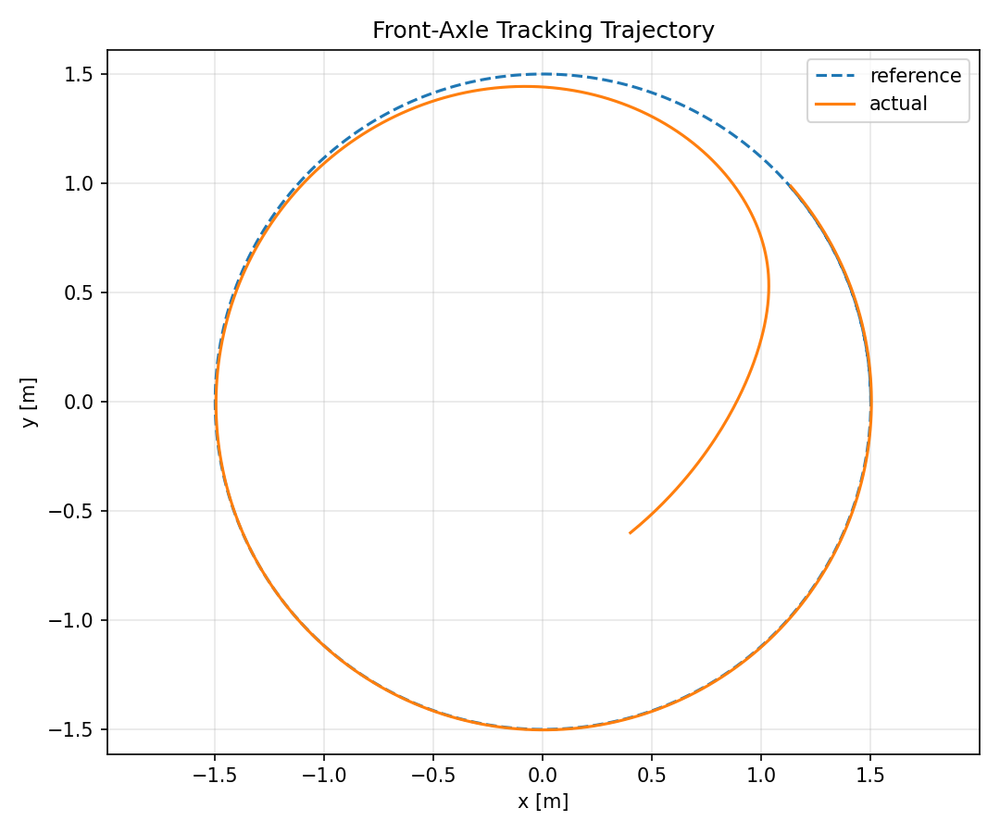
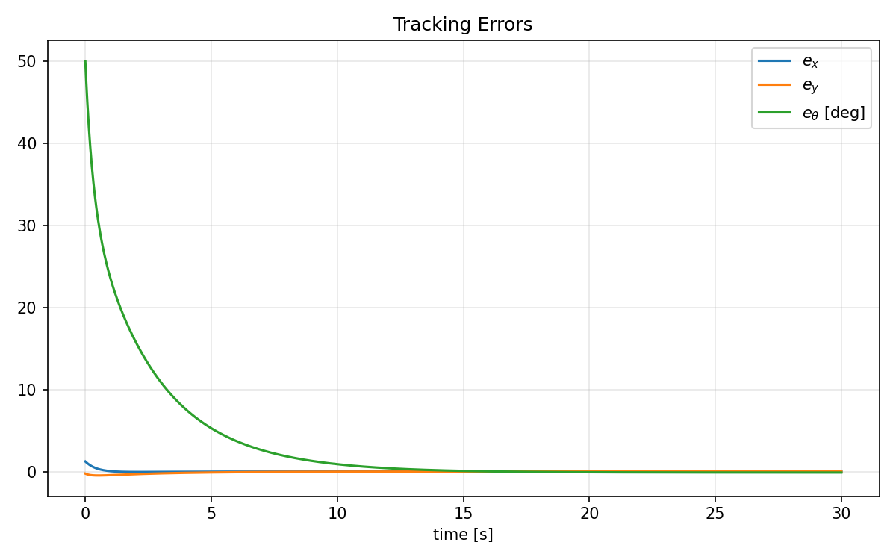
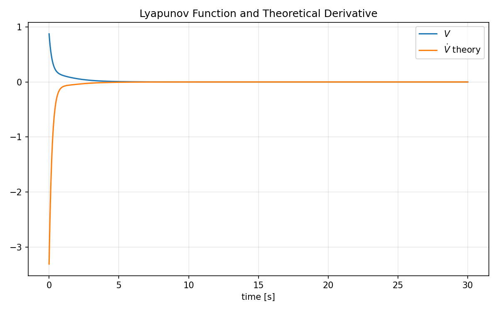
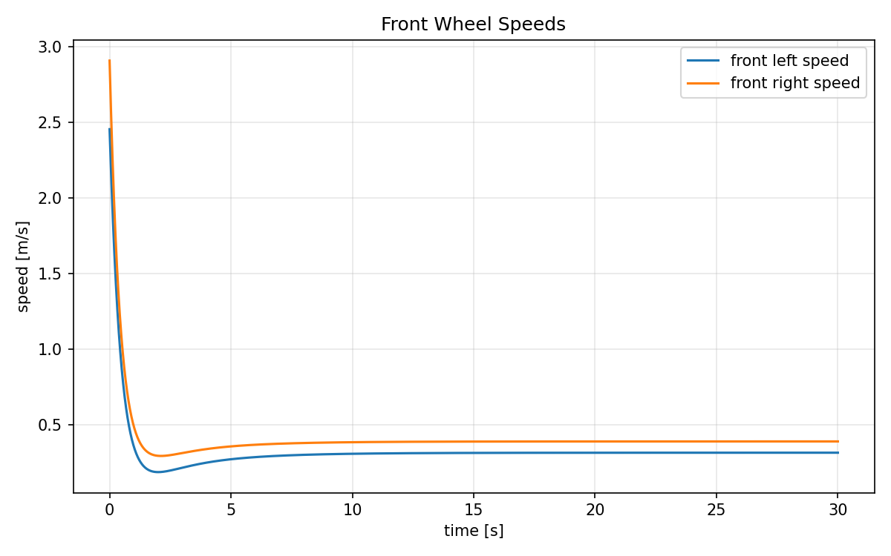
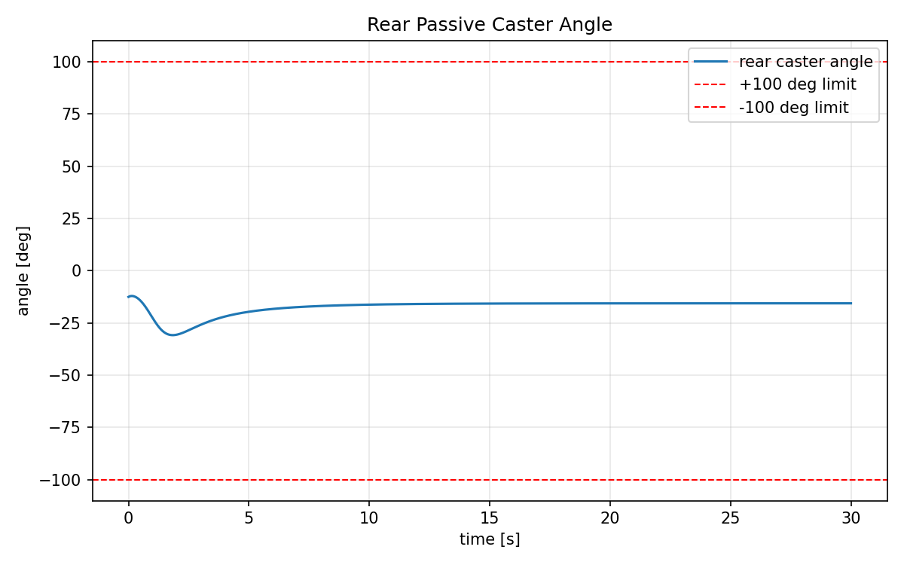

# 前轮差速 + 后轮从动倒三角车辆的 Lyapunov 控制器严谨推导

## 0. 结论先说清楚

之前给出的控制律是一个**运动学层面的 Lyapunov 轨迹跟踪控制器**。它不是完整动力学控制器。

它在以下假设下是严格成立的：

1. 控制对象可以用前轴中点的 unicycle kinematic model 表示。
2. 左右前轮差速可以准确产生期望的 \(v,\omega\)。
3. 后轮为被动从动脚轮，并且脚轮角度始终在机械范围内。
4. 控制输入没有饱和、没有限速、没有执行器延迟。
5. 参考轨迹足够光滑，并且参考前进速度 \(v_d(t)\) 在跟踪阶段不恒为零。
6. 讨论的是轨迹跟踪，不是静止点姿态全局镇定。

在这些假设下，可以证明跟踪误差局部渐近收敛。

如果加入真实车辆中的轮速饱和、加速度限制、通信延迟、脚轮角度极限主动裁剪，那么原始 Lyapunov 证明不再完整，需要额外的 saturated control / CLF-QP / hybrid supervisor 证明。

## 1. 车辆几何

车辆结构：

- 前轮左右差速驱动；
- 前轮轮距为 \(a\)；
- 后轮位于车体中线，是从动脚轮；
- 后轮接地点距离前轴中点为 \(b\)；
- 后轮脚轮角度限制为 \(|\gamma|\le 100^\circ\)；
- 重心位于车体中线，若没有额外测量，取前轴与后轮之间的中点：

$$
c = \frac{b}{2}
$$

其中 \(c\) 表示重心在前轴中点后方的距离。

## 2. 为什么选前轴中点作为控制点

令前轴中点为 \(P\)，其世界坐标为：

$$
p_P =
\begin{bmatrix}
x\\
y
\end{bmatrix}
$$

车体航向角为：

$$
\theta
$$

左右前轮地面线速度为：

$$
v_L,\quad v_R
$$

由于前轮差速直接作用在前轴，定义虚拟控制量：

$$
v = \frac{v_R+v_L}{2}
$$

$$
\omega = \frac{v_R-v_L}{a}
$$

于是前轴中点满足标准 unicycle 运动学：

$$
\dot{x} = v\cos\theta
$$

$$
\dot{y} = v\sin\theta
$$

$$
\dot{\theta} = \omega
$$

这就是 Lyapunov 控制器使用的名义模型。

注意：这里没有把整车动力学建成质量-惯量-轮胎力模型，而是把前轮差速车辆在运动学层面等效成可控制 \(v,\omega\) 的平面移动体。

## 3. 从 \(v,\omega\) 到左右前轮速度

控制器先计算 \(v,\omega\)，然后转换成左右前轮速度。

由：

$$
v = \frac{v_R+v_L}{2}
$$

$$
\omega = \frac{v_R-v_L}{a}
$$

解得：

$$
v_R = v + \frac{a}{2}\omega
$$

$$
v_L = v - \frac{a}{2}\omega
$$

因此 \(a\) 不直接出现在 Lyapunov 控制律中，而是出现在轮速分配中。

## 4. 后轮从动脚轮约束

后轮接地点在车体系下的位置为：

$$
r_R =
\begin{bmatrix}
-b\\
0
\end{bmatrix}
$$

前轴中点的车体系速度为：

$$
\begin{bmatrix}
v\\
0
\end{bmatrix}
$$

车体角速度为 \(\omega\)。后轮接地点相对于前轴中点还会产生旋转速度：

$$
\omega \times r_R
=
\begin{bmatrix}
0\\
-b\omega
\end{bmatrix}
$$

所以后轮接地点的车体系速度为：

$$
v_R^{body}
=
\begin{bmatrix}
v\\
-b\omega
\end{bmatrix}
$$

被动脚轮为了无侧滑，需要对齐该速度方向。因此所需脚轮角为：

$$
\gamma
=
\operatorname{atan2}(-b\omega,\ v)
$$

机械限制为：

$$
|\gamma| \le \gamma_{max}
$$

其中：

$$
\gamma_{max}=100^\circ
$$

如果 \(v>0\)，则 \(\gamma\) 通常在 \((-90^\circ,90^\circ)\) 内，因此 \(100^\circ\) 限制一般不会成为问题。

如果 \(v<0\)，后轮可能需要接近 \(180^\circ\) 的翻转角，此时会违反约束。

因此严谨控制实现中应加入可行性检查：

$$
|\operatorname{atan2}(-b\omega,v)| \le 100^\circ
$$

## 5. 重心与前轴中点的关系

若控制目标给的是重心 \(C\)，而控制模型使用前轴中点 \(P\)，需要做坐标转换。

重心在前轴中点后方距离 \(c=b/2\)，因此：

$$
p_C
=
p_P
-
c
\begin{bmatrix}
\cos\theta\\
\sin\theta
\end{bmatrix}
$$

反过来：

$$
p_P
=
p_C
+
c
\begin{bmatrix}
\cos\theta\\
\sin\theta
\end{bmatrix}
$$

因此如果参考轨迹是重心轨迹 \(p_{C,d}\)，应先转成前轴中点参考：

$$
p_{P,d}
=
p_{C,d}
+
c
\begin{bmatrix}
\cos\theta_d\\
\sin\theta_d
\end{bmatrix}
$$

然后对 \(P\) 做轨迹跟踪。

## 6. 参考轨迹

假设参考轨迹为：

$$
x_d(t),\quad y_d(t),\quad \theta_d(t)
$$

并且参考速度满足：

$$
\dot{x}_d = v_d\cos\theta_d
$$

$$
\dot{y}_d = v_d\sin\theta_d
$$

$$
\dot{\theta}_d = \omega_d
$$

其中：

$$
v_d(t),\quad \omega_d(t)
$$

为参考轨迹对应的前进速度和角速度。

## 7. 误差定义

定义世界系位置误差：

$$
\Delta x = x_d - x
$$

$$
\Delta y = y_d - y
$$

将误差旋转到当前车体系：

$$
e_x = \cos\theta\Delta x + \sin\theta\Delta y
$$

$$
e_y = -\sin\theta\Delta x + \cos\theta\Delta y
$$

航向误差：

$$
e_\theta = \operatorname{wrap}(\theta_d-\theta)
$$

意义：

- \(e_x\)：车体前向误差；
- \(e_y\)：车体横向误差；
- \(e_\theta\)：航向误差。

## 8. 误差动力学推导

由定义：

$$
e_x = \cos\theta(x_d-x)+\sin\theta(y_d-y)
$$

求导：

$$
\dot{e}_x
=
-\dot{\theta}\sin\theta(x_d-x)
+\cos\theta(\dot{x}_d-\dot{x})
+\dot{\theta}\cos\theta(y_d-y)
+\sin\theta(\dot{y}_d-\dot{y})
$$

代入：

$$
\dot{\theta}=\omega
$$

$$
\dot{x}=v\cos\theta,\quad \dot{y}=v\sin\theta
$$

$$
\dot{x}_d=v_d\cos\theta_d,\quad \dot{y}_d=v_d\sin\theta_d
$$

得到：

$$
\dot{e}_x
=
\omega e_y - v + v_d\cos e_\theta
$$

同理：

$$
\dot{e}_y
=
-\omega e_x + v_d\sin e_\theta
$$

以及：

$$
\dot{e}_\theta
=
\omega_d-\omega
$$

所以误差系统为：

$$
\boxed{
\begin{aligned}
\dot{e}_x &= \omega e_y - v + v_d\cos e_\theta\\
\dot{e}_y &= -\omega e_x + v_d\sin e_\theta\\
\dot{e}_\theta &= \omega_d-\omega
\end{aligned}
}
$$

## 9. Lyapunov 函数

选取：

$$
V(e)
=
\frac{1}{2}e_x^2
+
\frac{1}{2}e_y^2
+
\frac{1}{k_y}(1-\cos e_\theta)
$$

其中：

$$
k_x>0,\quad k_y>0,\quad k_\theta>0
$$

在 \(e_\theta\in(-\pi,\pi)\) 的局部区域内，\(V\) 对误差正定：

$$
V(e)\ge 0
$$

且：

$$
V(e)=0
\iff
e_x=e_y=e_\theta=0
$$

## 10. 控制律

选择：

$$
v
=
v_d\cos e_\theta
+
k_x e_x
$$

$$
\omega
=
\omega_d
+
k_y v_d e_y
+
k_\theta \sin e_\theta
$$

这是前轴中点的虚拟控制律。

## 11. Lyapunov 导数

对 \(V\) 求导：

$$
\dot{V}
=
e_x\dot{e}_x
+
e_y\dot{e}_y
+
\frac{1}{k_y}\sin e_\theta\dot{e}_\theta
$$

代入误差动力学：

$$
\dot{V}
=
e_x(\omega e_y-v+v_d\cos e_\theta)
+
e_y(-\omega e_x+v_d\sin e_\theta)
+
\frac{1}{k_y}\sin e_\theta(\omega_d-\omega)
$$

注意交叉项抵消：

$$
e_x\omega e_y - e_y\omega e_x = 0
$$

因此：

$$
\dot{V}
=
e_x(-v+v_d\cos e_\theta)
+
e_y v_d\sin e_\theta
+
\frac{1}{k_y}\sin e_\theta(\omega_d-\omega)
$$

代入控制律：

$$
v
=
v_d\cos e_\theta + k_x e_x
$$

得到：

$$
-v+v_d\cos e_\theta
=
-k_x e_x
$$

又因为：

$$
\omega
=
\omega_d+k_y v_d e_y+k_\theta\sin e_\theta
$$

所以：

$$
\omega_d-\omega
=
-k_y v_d e_y
-k_\theta\sin e_\theta
$$

代回：

$$
\dot{V}
=
-k_x e_x^2
+
e_y v_d\sin e_\theta
+
\frac{1}{k_y}\sin e_\theta
(-k_y v_d e_y-k_\theta\sin e_\theta)
$$

展开：

$$
\dot{V}
=
-k_x e_x^2
+
e_y v_d\sin e_\theta
-
e_y v_d\sin e_\theta
-
\frac{k_\theta}{k_y}\sin^2 e_\theta
$$

得到：

$$
\boxed{
\dot{V}
=
-k_x e_x^2
-
\frac{k_\theta}{k_y}\sin^2 e_\theta
\le 0
}
$$

这说明 \(V\) 非增。

## 12. 收敛性说明

由：

$$
\dot{V}\le0
$$

可知 \(e_x,e_y,e_\theta\) 有界，且：

$$
e_x \in L_2,\quad \sin e_\theta \in L_2
$$

同时在参考速度和参考角速度有界、控制律无饱和的条件下，误差导数有界。

根据 Barbalat 引理：

$$
e_x(t)\to0
$$

$$
\sin e_\theta(t)\to0
$$

在局部区域 \(e_\theta\in(-\pi/2,\pi/2)\) 内，有：

$$
\sin e_\theta \to0
\Rightarrow
e_\theta\to0
$$

现在还需要证明 \(e_y\to0\)。

由：

$$
\dot{e}_\theta
=
\omega_d-\omega
=
-k_y v_d e_y - k_\theta\sin e_\theta
$$

当 \(e_\theta\to0\)、\(\dot{e}_\theta\to0\)、且 \(v_d\) 不趋于 0 时：

$$
-k_y v_d e_y \to 0
$$

若存在：

$$
v_d(t)\ge v_{min}>0
$$

则：

$$
e_y(t)\to0
$$

因此，在持续前进参考轨迹条件下：

$$
\boxed{
e_x(t),e_y(t),e_\theta(t)\to0
}
$$

这就是严格意义上的局部渐近轨迹跟踪结论。

## 13. 不是全局静止点镇定

这个控制律不是任意静止目标点的全局姿态镇定控制器。

原因：

1. unicycle-like 系统受 Brockett 条件限制，不能用连续光滑时不变反馈实现全局渐近稳定到任意姿态。
2. Lyapunov 函数中 \(1-\cos e_\theta\) 在 \(e_\theta=\pi\) 处也有特殊不期望平衡点。
3. 当 \(v_d=0\) 时，横向误差 \(e_y\) 缺少通过 \(v_d e_y\) 项进入航向控制的耦合。

因此这个控制器适合：

- 跟踪移动轨迹；
- 路径跟踪；
- 参考速度非零的行驶任务。

不适合单独作为：

- 停车入位；
- 原地姿态全局镇定；
- 带强饱和约束的完整低层控制器。

这些场景需要 hybrid controller、backstepping parking controller、CLF-QP 或 MPC-like constrained optimizer。

## 14. 轮速与后轮角约束

控制器输出：

$$
v,\omega
$$

实际前轮速度：

$$
v_R = v+\frac{a}{2}\omega
$$

$$
v_L = v-\frac{a}{2}\omega
$$

后轮脚轮角：

$$
\gamma
=
\operatorname{atan2}(-b\omega,\ v)
$$

必须检查：

$$
|\gamma|\le100^\circ
$$

如果加入饱和：

$$
|v_L|\le v_{wheel,max}
$$

$$
|v_R|\le v_{wheel,max}
$$

则原始控制律会被改变，严格的 \(\dot{V}\le0\) 证明不再直接成立。

## 15. 更严谨的实际实现建议

实际车辆上建议结构为：

1. Lyapunov 控制律生成 nominal \(v,\omega\)。
2. 计算 nominal \(v_L,v_R,\gamma\)。
3. 检查轮速和后轮角约束。
4. 若不满足约束，使用 constrained projection：

$$
\min_{v,\omega}
\left\|
\begin{bmatrix}
v\\
\omega
\end{bmatrix}
-
\begin{bmatrix}
v_{nom}\\
\omega_{nom}
\end{bmatrix}
\right\|_Q^2
$$

subject to:

$$
|v+\frac{a}{2}\omega|\le v_{wheel,max}
$$

$$
|v-\frac{a}{2}\omega|\le v_{wheel,max}
$$

$$
|\operatorname{atan2}(-b\omega,v)|\le100^\circ
$$

5. 使用投影后的 \(v,\omega\) 输出轮速。

如果还想保留严格 Lyapunov 下降，需要进一步加入 CLF 约束：

$$
\dot{V}(e,v,\omega)\le -\alpha V(e)
$$

这会变成 CLF-QP 控制器。

## 16. 最终控制器

误差：

$$
e_x = \cos\theta(x_d-x)+\sin\theta(y_d-y)
$$

$$
e_y = -\sin\theta(x_d-x)+\cos\theta(y_d-y)
$$

$$
e_\theta = \operatorname{wrap}(\theta_d-\theta)
$$

控制律：

$$
v
=
v_d\cos e_\theta
+
k_xe_x
$$

$$
\omega
=
\omega_d
+
k_yv_de_y
+
k_\theta\sin e_\theta
$$

轮速：

$$
v_R = v+\frac{a}{2}\omega
$$

$$
v_L = v-\frac{a}{2}\omega
$$

后轮角：

$$
\gamma
=
\operatorname{atan2}(-b\omega,\ v)
$$

稳定性结论：

在无饱和、参考速度持续非零、脚轮角可行、运动学模型成立的条件下：

$$
e_x,e_y,e_\theta\to0
$$

即前轴中点轨迹局部渐近跟踪参考轨迹。

## 17. 可视化结果

几何建模示意：

闭环控制流程：

Lyapunov 证明逻辑：

轨迹跟踪仿真：

误差收敛：

Lyapunov 函数与理论导数：

前轮左右轮速：

后轮从动脚轮角度：

当前仿真参数为：

$$
a=0.32,\quad b=0.42,\quad k_x=2.0,\quad k_y=4.0,\quad k_\theta=2.0
$$

仿真结果：

$$
e_x(30s)\approx0.0003,\quad e_y(30s)\approx0.0030,\quad e_\theta(30s)\approx-0.12^\circ
$$

后轮最大从动角约为：

$$
\max_t |\gamma(t)| \approx 30.84^\circ < 100^\circ
$$
