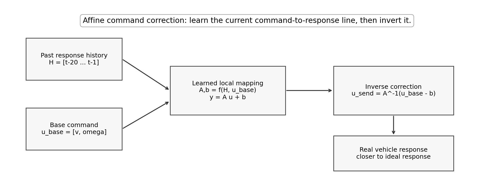
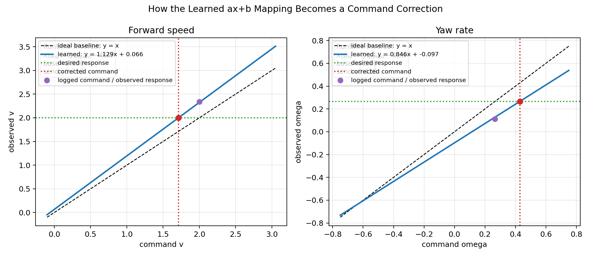

# CorrectionControl 模型和 Motor Controller 原理

本文档解释 `CorrectionControl` 的模型、训练输入输出、运行时输入输出，以及 motor controller 如何把修正后的命令编码成 CAN。

## 1. 这个模型解决什么问题

传统控制器会输出：

```text
u_base = [base_v, base_omega]
```

它表示希望车辆达到的理想响应。

真实车辆不会严格满足理想 differential-drive 模型。可能有：

- 前向速度响应不足；
- yaw rate 响应不足；
- 摩擦、延迟、固定偏置；
- 最近车辆状态对当前响应有影响。

所以 `CorrectionControl` 不直接预测轨迹，也不直接输出 CAN。它学习当前车辆的动态 `ax+b` 响应关系：

```text
meas_v     = a_v     * cmd_v     + b_v
meas_omega = a_omega * cmd_omega + b_omega
```

然后 runtime 反解得到修正后的 command。

## 2. `ax+b` 的含义

理想 baseline 是：

```text
y = x
```

也就是：

```text
a_v = 1
a_omega = 1
b_v = 0
b_omega = 0
```

真实车辆的局部响应写成：

```text
y = ax + b
```

这里的 `a` 和 `b` 不是固定参数，而是每个 runtime step 都由神经网络根据历史动态估计。

直观解释：

- `a_v < 1`：同样的速度命令下，车实际跑得偏慢。
- `a_v > 1`：同样的速度命令下，车实际跑得偏快。
- `b_v != 0`：前向速度存在固定偏置。
- `a_omega < 1`：转向响应偏弱。
- `b_omega != 0`：yaw rate 有固定偏置或 drift。

可视化图：





## 3. 神经网络训练输入

训练历史窗口固定为：

```text
H = [z_{t-20}, z_{t-19}, ..., z_{t-1}]
```

每个历史点的顺序必须是：

```text
z = [cmd_v, cmd_omega, meas_v, meas_omega]
```

训练采样周期是：

```text
dt = 0.05 s
```

所以 20 个样本大约表示 1 秒历史。

训练时还输入当前 command：

```text
u_t = [cmd_v, cmd_omega]
```

所以训练输入是：

```text
(H, u_t)
```

## 4. 神经网络训练输出

模型输出：

```text
[a_v, a_omega, b_v, b_omega]
```

然后构造响应预测：

```text
pred_meas_v     = a_v     * cmd_v     + b_v
pred_meas_omega = a_omega * cmd_omega + b_omega
```

训练 label 是观测响应：

```text
[meas_v, meas_omega]
```

当前数据里：

```text
meas_v     = vn_body_vx
meas_omega = odom_omega_z
```

## 5. Runtime 输入输出

运行时输入：

```text
history = [z_{t-20}, ..., z_{t-1}]
u_base = [base_v, base_omega]
```

模型输出：

```text
[a_v, a_omega, b_v, b_omega]
```

motor controller 反解：

```text
corrected_v     = (base_v     - b_v)     / a_v
corrected_omega = (base_omega - b_omega) / a_omega
```

如果 history 还没 ready，直接 bypass：

```text
u_send = u_base
```

## 6. 为什么 history 不能 fake padding

模型训练时看到的是 20 个真实样本，时间跨度大约 0.95 秒。

runtime 刚启动时，如果历史不够，不能用第一个样本重复 20 次来凑窗口。那样 GRU 会把假的重复数据当成真实 1 秒动态，容易输出错误 correction。

因此当前 runtime 逻辑是：

```text
history 不够 -> 不用模型 -> 直接发送 base command
```

## 7. Motor Controller 输出

修正后的 command：

```text
[corrected_v, corrected_omega]
```

会继续走传统 differential-drive 转换：

```text
right wheel RPM
left wheel RPM
```

最后发布：

```text
can_msgs/msg/Frame
```

CAN 格式保持不变：

```text
id  = 0x210
dlc = 8
bytes 0-3: right wheel RPM, signed int32 little-endian
bytes 4-7: left wheel RPM,  signed int32 little-endian
```

## 8. 本次整理做了什么

本次整理把相关内容统一到：

```text
CorrectionControl/
```

包括：

- `LegacyNeurokinBackup/`：旧 `neurokin_mpc` 的轻量备份；
- `Training/`：当前 CorrectionControl 训练脚本、模型、图和报告；
- `Temp/ros2unbag_exports/`：ros2unbag 导出的三个 topic CSV；
- `Temp/processed/`：对齐后的训练输入；
- `docs/`：模型和 motor controller 说明文档。

使用的 bag 是：

```text
E:\Mess\Projects\Programming\aiformula\aiformula_sophia\bag\bag\rosbag2_2026_01_20-15_31_07
```

使用的 ros2unbag 工具来自：

```text
E:\Mess\Projects\Programming\aiformula\ros2unbag
```

已经验证：

```text
ros2unbag exports -> aligned_timeseries.csv -> training -> correction_control.pt -> figures
```

这个链路可以跑通。

生成的训练图保存在：

```text
CorrectionControl/Training/figures/
```

其中比较重要的是：

- `test_response_prediction.png`：模型预测响应和实测响应的比较；
- `test_command_correction.png`：修正前后的 command 比较；
- `history_conditioned_affine_lines.png`：不同历史状态下动态 `ax+b` 关系的变化。
